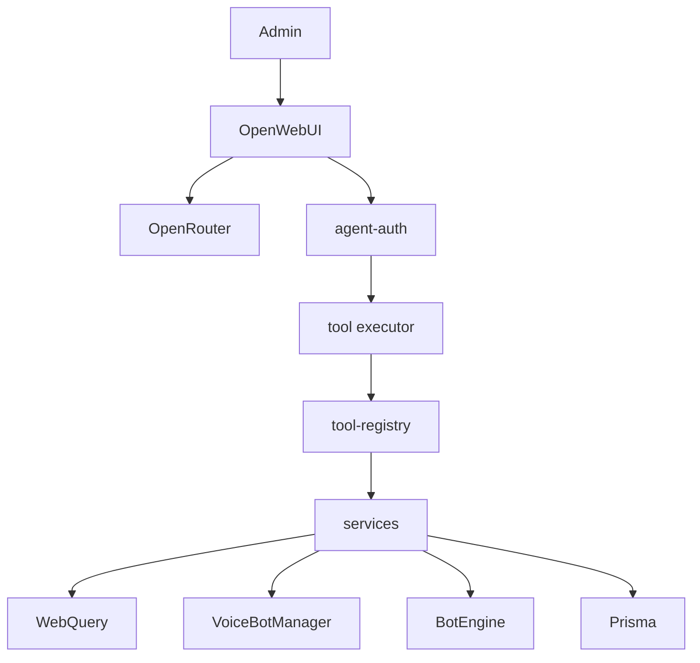

# AI Agent Gateway Design

**Spec**: `.specs/features/ai-agent-gateway/spec.md`
**Status**: Approved

---

## Architecture Overview

The gateway is a new Express mount on the existing backend process. It authenticates with a service bearer plus an Open WebUI identity JWT, then runs one registry of tools. Each tool calls extracted services that REST handlers also use. OpenAPI and MCP are adapters over that registry. Open WebUI runs from an optional Compose overlay and never receives WebQuery keys, SSH, Prisma, or manager objects.

Chosen approach: in-process registry + adapters (confirmed). Rejected: MCP calling local HTTP, copying business rules, adding an agent framework.



Gateway routes mount in `createApp()` **before** `app.use('/api', authMiddleware)`. When `config.ai.enabled` is false, those routes are not registered.

---

## Code Reuse Analysis

### Existing Components to Leverage

| Component | Location | How to Use |
| --------- | -------- | ---------- |
| `requireSecret` fail-closed | `packages/backend/src/config.ts` | Same pattern for AI secrets when enabled |
| `ConnectionPool` | `packages/backend/src/ts-client/connection-pool.ts` | `getClient` / `hasClient` from services |
| Dashboard cache | `packages/backend/src/routes/dashboard.routes.ts` | Move cache + aggregation into server-management service |
| Channel REST fields | `packages/frontend/src/pages/Channels.tsx` | Service allowlist: `channel_name`, flags, topic, password, `cpid` |
| Client IP omission | `packages/backend/src/routes/clients.routes.ts` | Agent list never includes `-ip` |
| `permfind` / `permoverview` | `packages/backend/src/routes/permissions.routes.ts` | Permission service |
| `VoiceBotManager` | `packages/backend/src/voice/voice-bot-manager.ts` | start/stop/getBot |
| `downloadAndEnqueue` / `enqueueSpotify` | `packages/backend/src/voice/music-ops.ts` | `play_media_url` (already calls `validateUrl`) |
| `BotEngine.enableFlow` / `disableFlow` | `packages/backend/src/bot-engine/engine.ts` | Flow tools; do not call private `executeFlow` |
| `authMiddleware` JWT verify | `packages/backend/src/middleware/auth.ts` | Pattern for HS256; **different secret** for Open WebUI JWT |
| `auth.test.ts` helpers | `packages/backend/src/middleware/auth.test.ts` | Fake req/res + `jsonwebtoken.sign` |
| i18n fragments | `packages/frontend/scripts/i18n-fragments/` | New `nav` fragment; never edit locale files by hand |
| Sidecar compose pattern | `docker-compose.yml` + AD-001 | Overlay service, internal network, unpublished MCP |

### Integration Points

| System | Integration Method |
| ------ | ------------------ |
| Prisma | New `AiActionLog`; `db push` at Docker start; checked-in DDL in `prisma/sql/` |
| Express | Mount `/api/agent` before session `authMiddleware` |
| Open WebUI | Admin tool server `http://backend:3001/api/agent/openapi.json` |
| Frontend | `GET /api/auth/me` adds `aiAssistantUrl` for admins |
| Nginx | Deny `/api/agent/mcp` on the public frontend image |

---

## Components

### ai config

- **Purpose**: Fail-closed AI flags and secrets.
- **Location**: `packages/backend/src/config.ts`
- **Interfaces**:
  - `config.ai.enabled: boolean`
  - `config.ai.gatewayToken: string | undefined`
  - `config.ai.identityJwtSecret: string | undefined`
  - `config.ai.destructiveToolsEnabled: boolean`
  - `config.ai.allowedUserIds: string[]`
  - `config.ai.allowedEmails: string[]`
  - `config.ai.assistantPublicUrl: string | undefined`
- **Dependencies**: `process.env`
- **Reuses**: `requireSecret` length check

### AgentError

- **Purpose**: Public tool error codes and JSON shape.
- **Location**: `packages/backend/src/agent/agent-error.ts`
- **Interfaces**:
  - `toToolError(err, requestId): { success: false, error: { code, message, retryable }, requestId }`
- **Dependencies**: none
- **Reuses**: none (do not leak `AppError` stacks)

### AgentContext

- **Purpose**: Authenticated execution bag. Tools never take identity from model args.
- **Location**: `packages/backend/src/agent/agent-context.ts`
- **Interfaces**: `AgentContext` with `actor`, `chatId`, `messageId`, `requestId`, `prisma`, `connectionPool`, `voiceBotManager`, `botEngine`
- **Dependencies**: Prisma, managers on `app.locals`
- **Reuses**: `app.locals` wiring in `index.ts`

### agent-auth

- **Purpose**: Bearer + Open WebUI JWT + allowlists.
- **Location**: `packages/backend/src/agent/agent-auth.ts`
- **Interfaces**:
  - `assertGatewayBearer(header, token): void`
  - `verifyOpenWebUiJwt(token): AgentActor`
  - `assertAllowlists(actor): void`
  - `agentAuthMiddleware` for execute routes
- **Dependencies**: `crypto.timingSafeEqual`, `jsonwebtoken`, `config.ai`
- **Reuses**: HS256 verify style from `auth.ts` with a **different** secret

### sanitize + audit + executor

- **Purpose**: Redact secrets, persist `AiActionLog`, idempotent execute-once.
- **Location**: `packages/backend/src/agent/agent-audit.service.ts`, `packages/backend/src/agent/tool-executor.ts`
- **Interfaces**:
  - `sanitizeForLog(value: unknown): unknown`
  - `executeTool(registry, context, name, input): Promise<ToolResult>`
- **Dependencies**: Prisma `aiActionLog`
- **Reuses**: none

### services

- **Purpose**: Shared operations for REST and tools.
- **Location**: `packages/backend/src/services/*.service.ts`
- **Interfaces**: typed methods listed in the plan (list/get/create/move/etc.)
- **Dependencies**: `ConnectionPool`, Prisma, `VoiceBotManager`, `BotEngine`, `music-ops`
- **Reuses**: current route command names (`channellist`, `clientmove`, …)

### tool-registry

- **Purpose**: Single catalog. OpenAPI/MCP read this.
- **Location**: `packages/backend/src/agent/tool-registry.ts`
- **Interfaces**:
  - `getExposedTools(): AgentToolDefinition[]` respects destructive flag
  - `getTool(name): AgentToolDefinition | undefined`
- **Dependencies**: services, Zod
- **Reuses**: none

### OpenAPI adapter

- **Purpose**: Document + POST execute.
- **Location**: `packages/backend/src/agent/openapi/`
- **Interfaces**: `GET /api/agent/openapi.json`, `POST /api/agent/tools/:toolName`
- **Dependencies**: registry, executor, agent-auth
- **Reuses**: `z.toJSONSchema` when available

### MCP adapter

- **Purpose**: Stateless Streamable HTTP.
- **Location**: `packages/backend/src/agent/mcp/`
- **Interfaces**: `GET|POST /api/agent/mcp`
- **Dependencies**: `@modelcontextprotocol/server@2.0.0`, `express@2.0.0`, `node@2.0.0`
- **Reuses**: same registry/executor

### Open WebUI overlay

- **Purpose**: Optional UI container.
- **Location**: `docker-compose.ai.yml`
- **Interfaces**: service `open-webui` on `ts6-network`
- **Dependencies**: env secrets
- **Reuses**: AD-001 unpublished-internal-port pattern for MCP

---

## Data Models

### AiActionLog

```prisma
model AiActionLog {
  id                 Int      @id @default(autoincrement())
  requestId          String   @unique
  idempotencyKey     String?
  externalUserId     String
  actorEmail         String?
  actorName          String?
  chatId             String?
  messageId          String?
  serverConfigId     Int?
  virtualServerId    Int?
  toolName           String
  risk               String
  sanitizedArguments String
  sanitizedResult    String?
  status             String
  errorCode          String?
  durationMs         Int?
  createdAt          DateTime @default(now())

  @@unique([externalUserId, toolName, idempotencyKey])
  @@index([externalUserId, createdAt])
  @@index([toolName, createdAt])
  @@index([serverConfigId, createdAt])
}
```

SQLite unique with nullable `idempotencyKey`: Prisma/SQLite treats NULLs as distinct, so logs without a key do not collide. Mutating tools that send a key are deduped.

**Relationships**: none to `User` (actor is an Open WebUI id, not a TS6 user row).

### Tool result

```typescript
type ToolSuccess = {
  success: true
  action: string
  requestId: string
  [key: string]: unknown
}

type ToolFailure = {
  success: false
  error: { code: string; message: string; retryable: boolean }
  requestId: string
}
```

---

## Error Handling Strategy

| Error Scenario | Handling | User Impact |
| -------------- | -------- | ----------- |
| Missing/invalid bearer or JWT | HTTP 401 `UNAUTHENTICATED` | Model sees auth failed |
| Non-admin or allowlist miss | HTTP 403 `FORBIDDEN` | No tool run |
| Unknown tool / destructive hidden | `TOOL_NOT_FOUND` | No mutation |
| Zod failure | `INVALID_INPUT` | Model must fix args |
| Disabled/missing server | `SERVER_NOT_FOUND` | No WebQuery |
| Pool miss | `SERVER_DISCONNECTED` retryable | Retry later |
| TS command error | `TEAMSPEAK_ERROR` or mapped not-found | Short message, no stack |
| Timeout | `TIMEOUT` retryable | Retry |
| Audit write fails after mutate | Log console error; do not re-run tool | Gap in log, no double action |

---

## Risks & Concerns

| Concern | Location (file:line) | Impact | Mitigation |
| ------- | -------------------- | ------ | ---------- |
| Routes embed WebQuery with open `req.body` | `channels.routes.ts:31` | Tightening REST would break the SPA | Service allowlist matches current UI fields; REST wrappers pass the same fields |
| `executeFlow` is private | `engine.ts:697` | Cannot safely run flows on demand | `run_bot_flow` never exposed |
| `play-url` skips `validateUrl` | `music-bots.routes.ts:229` | SSRF if the agent/REST gets a bad URL | `play_media_url` and the REST wrapper use `downloadAndEnqueue` |
| Zod unused / MCP wants v4 | `package.json` | Peer mismatch | Pin MCP 2.0.0; bump backend Zod if required |
| Open WebUI cannot force destructive approval | Open WebUI 0.11.3 | Silent destructive calls | Flag off by default |
| Public nginx proxies all `/api` | `Dockerfile.frontend:29` | MCP reachable from the internet | Deny location for `/api/agent/mcp` |
| Frontend Docker ignores `VITE_*` | `Dockerfile.frontend` | Hidden nav item in prod | Runtime URL on `/api/auth/me` |
| Prisma migrations gitignored | `.gitignore` | No migrate history | Schema + `db push` + checked-in SQL |
| `dashboard.routes.ts` uses `any` cache | L14 | Type noise | Service can keep the cache; do not expand `any` into new files |
| In-memory dashboard cache | `dashboard.routes.ts:14` | Fine for single backend (known debt) | Keep 5s TTL in the extracted service |

---

## Tech Decisions (only non-obvious ones)

| Decision | Choice | Rationale |
| -------- | ------ | --------- |
| Where the gateway authenticates | Own middleware, mounted before session JWT | Service token is not a user access token (`typ=access`) |
| How MCP is hidden | Nginx 403 on the public frontend; Open WebUI uses `http://backend:3001` | Spec: do not publish MCP |
| How OpenAPI lists tools | One path per tool in the document; one Express handler `POST /tools/:toolName` | Stable `operationId`; less Express surface |
| Idempotency store | `AiActionLog` unique (actor, tool, key) | No extra table |
| Assistant URL | `/auth/me` field, not a public unauthenticated endpoint | Avoid advertising the Open WebUI URL to anonymous clients |

> **Project-level decisions:** AD-002 in `.specs/STATE.md`: Agent tools go through an in-process gateway registry; Open WebUI is an optional overlay, never a direct consumer of WebQuery/Prisma/managers.
