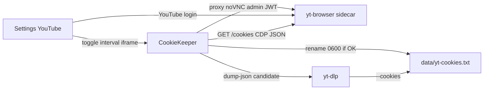

# YouTube Cookie Auto-Refresh Design

**Spec**: `.specs/features/youtube-cookie-refresh/spec.md`
**Status**: Approved

---

## Architecture Overview

A dedicated **yt-browser sidecar** runs Chromium (Xvfb + persistent profile + noVNC) and a small HTTP API. The backend **CookieKeeper** pulls cookies over that API, converts them to Netscape, validates with yt-dlp, and atomically replaces `data/yt-cookies.txt`. The Settings YouTube tab toggles the feature and embeds noVNC through an **admin-authenticated** backend proxy. Playback keeps calling `getCookieArgs()` as today.

Chosen approach: sidecar (AD-001). Rejected: Chromium inside the backend image; Playwright without a display (no in-app login).



---

## Code Reuse Analysis

### Existing Components to Leverage

| Component | Location | How to Use |
| --------- | -------- | ---------- |
| Cookie file + `setYtCookieFile` | `packages/backend/src/voice/audio/youtube.ts` | Refresh writes the same path the playback path already reads |
| Cookie HTTP | `packages/backend/src/routes/settings.routes.ts` | Keep upload/paste/delete; add refresh routes beside them |
| AppSetting KV | `packages/backend/src/utils/app-settings.ts` | Same upsert pattern as `max_playlist_import` |
| Sidecar HTTP + bearer | `packages/backend/src/voice/streaming/sidecar-client.ts` | Copy fetch + `Authorization: Bearer` for yt-browser |
| Admin guard | `settings.routes.ts` `requireAdmin` | Reuse on new routes |
| `runYtDlp` / `lastErrorLine` | `youtube.ts` | Validation spawn; bot-check detection on stderr |
| YouTubeTab | `packages/frontend/src/pages/Settings.tsx` | Extract, then add toggle + iframe |
| i18n fragments | `packages/frontend/scripts/i18n-fragments/settings.json` | Add keys; never edit locale files by hand |

### Integration Points

| System | Integration Method |
| ------ | ------------------ |
| Prisma AppSetting | keys `youtube.cookieRefresh.enabled`, `youtube.cookieRefresh.intervalHours` |
| Docker compose | new `yt-browser` service; `YT_BROWSER_URL`, `YT_BROWSER_NOVNC_URL`, `YT_BROWSER_TOKEN` |
| Bootstrap | `app.locals.cookieKeeper`; start timer if enabled; stop on shutdown |

---

## Components

### cookie-refresh helpers

- **Purpose**: Pure functions for interval parsing, Netscape conversion, YouTube-domain check, atomic swap, bot-check detection.
- **Location**: `packages/backend/src/voice/audio/cookie-refresh.ts`
- **Interfaces**:
  - `parseIntervalHours(raw: unknown): number | null` - 1–24 or null
  - `cookiesToNetscape(cookies: CdpCookie[]): string`
  - `hasYoutubeCookies(netscape: string): boolean`
  - `atomicSwapCookieFile(livePath: string, candidate: string): void` - write temp, chmod 0600, rename
  - `isBotCheckError(message: string): boolean` - true iff message includes `Sign in to confirm you're not a bot`
- **Dependencies**: `fs`, `path`
- **Reuses**: `parseImportCap` style from `app-settings.ts`

### CookieKeeper

- **Purpose**: Orchestrate export → validate → swap, cooldown, in-flight join, enable/disable, status.
- **Location**: `packages/backend/src/voice/audio/cookie-keeper.ts`
- **Interfaces**:
  - `enable(intervalHours: number): Promise<void>` - ping sidecar; persist; start timer; throw `SidecarUnreachableError` if down
  - `disable(): Promise<void>` - persist false; stop timer
  - `refreshNow(opts?: { force?: boolean }): Promise<'ok' \| 'skipped' \| 'failed'>`
  - `notifyBotCheck(): void` - enqueue refresh if enabled
  - `getStatus(): Promise<CookieRefreshStatus>`
- **Dependencies**: prisma, yt-browser HTTP client, `runYtDlp`, cookie-refresh helpers
- **Reuses**: sidecar-client bearer fetch

### yt-browser sidecar

- **Purpose**: Headful Chromium with a persistent profile, noVNC for login, CDP cookie dump.
- **Location**: `packages/yt-browser/server.mjs`, `Dockerfile.yt-browser`
- **Interfaces**:
  - `GET /health` - 200 if Chromium debugging port is up
  - `GET /cookies` - JSON `{ cookies: CdpCookie[] }` behind Bearer token
  - noVNC HTTP/WS on internal port 6080
- **Dependencies**: Chromium, Xvfb, x11vnc, novnc, websockify
- **Reuses**: media sidecar env pattern (`*_TOKEN`, unpublished ports)

### Settings routes

- **Purpose**: Admin HTTP for config, status, force refresh, noVNC proxy.
- **Location**: `packages/backend/src/routes/yt-cookie-refresh.routes.ts`
- **Interfaces**:
  - `GET /api/settings/yt-cookie-refresh` - status DTO
  - `PUT /api/settings/yt-cookie-refresh` - `{ enabled, intervalHours? }`
  - `POST /api/settings/yt-cookie-refresh/refresh` - force refresh
  - `ALL /api/settings/yt-browser/vnc/*` - proxy to noVNC
- **Dependencies**: CookieKeeper, requireAdmin
- **Reuses**: settings.routes admin guard

### YouTubeTab

- **Purpose**: Existing cookie file UI plus optional refresh card.
- **Location**: `packages/frontend/src/pages/settings/YouTubeTab.tsx`
- **Interfaces**: React component used from Settings tabs
- **Dependencies**: settings API, i18n
- **Reuses**: current YouTubeTab markup

---

## Data Models

### CookieRefreshStatus

```typescript
interface CookieRefreshStatus {
  enabled: boolean;
  sidecarReachable: boolean;
  lastSuccessAt: string | null; // ISO-8601 or null
  lastError: string | null;     // redacted
  cookieFileActive: boolean;
  needsLogin: boolean;
}
```

### CdpCookie

```typescript
interface CdpCookie {
  name: string;
  value: string;
  domain: string;
  path: string;
  expires?: number;
  secure?: boolean;
  httpOnly?: boolean;
}
```

### AppSetting keys

- `youtube.cookieRefresh.enabled` — `"true"` / `"false"`
- `youtube.cookieRefresh.intervalHours` — `"1"` … `"24"`

**Relationships**: no new Prisma models. Cookie bytes stay on disk (`data/yt-cookies.txt`). Profile stays in the yt-browser volume.

---

## Error Handling Strategy

| Error Scenario | Handling | User Impact |
| -------------- | -------- | ----------- |
| Enable with no sidecar | HTTP 400, toggle stays off | Message that yt-browser is required |
| Export/validation fail | Keep live file, set lastError, needsLogin if no youtube.com cookies | Status shows failure; playback uses old file |
| Bot-check during play | Enqueue refresh; rethrow original error | Current track fails; next attempt may work |
| Cooldown | Return skipped | Status unchanged |
| noVNC as non-admin | authMiddleware 401 / requireAdmin 403 | Iframe blank |

---

## Risks & Concerns

| Concern | Location | Impact | Mitigation |
| ------- | -------- | ------ | ---------- |
| Settings.tsx monolith (~1650 lines) | `packages/frontend/src/pages/Settings.tsx` | Hard to add iframe safely | Extract YouTubeTab in T7 |
| Chrome Cookies SQLite locked while running | n/a (would be `--cookies-from-browser`) | Empty/logged-out export | CDP dump on the sidecar (AD-001) |
| Helmet / X-Frame-Options on proxied noVNC | `app.ts` helmet() | Iframe blank | Strip `X-Frame-Options` / `frame-ancestors` on the proxy response |
| Cookie values in logs | `youtube.ts` stderr | Session leak | Redact in keeper logs and lastError |
| No route-level HTTP tests in repo | `packages/backend/src/routes/*.test.ts` | Routes historically untested | Extract status mapping and PUT validation as unit-tested functions; no supertest |
| Datacenter IP still blocked by YouTube | yt-dlp | Feature cannot promise playback | Spec success is session freshness, not bypass |

---

## Tech Decisions (only non-obvious ones)

| Decision | Choice | Rationale |
| -------- | ------ | --------- |
| Where Chromium runs | yt-browser sidecar | AD-001; matches media sidecar |
| How cookies leave Chrome | CDP `Network.getAllCookies` via sidecar HTTP | Avoids locked SQLite |
| How noVNC is exposed | Backend reverse-proxy under `/api/settings/yt-browser/vnc` | JWT + requireAdmin; port unpublished |
| Validate URL | `https://www.youtube.com/watch?v=jNQXAC9IVRw` | Injected in tests; no network in unit tests |
| New npm dep for WS proxy | Node `http` + `http-proxy` (or equivalent already present) | noVNC needs HTTP upgrade; do not hand-roll WS framing if a small dep is required |
