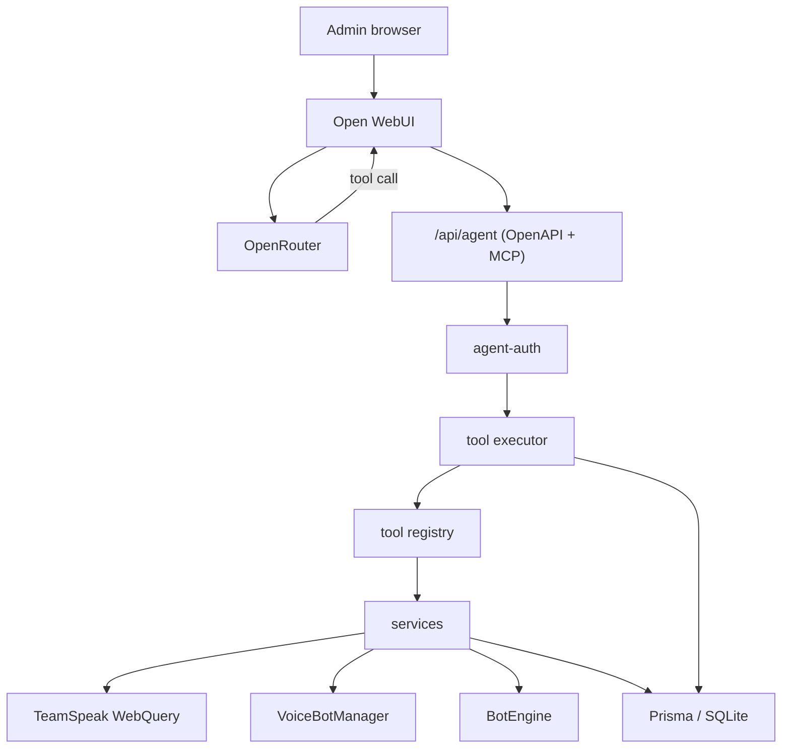

# AI Agent Gateway — Architecture

The gateway is an Express mount on the existing backend process, not a new service. Open WebUI talks to it over HTTP with a service bearer plus a signed identity header; the gateway then runs tools from one registry. Open WebUI never receives WebQuery keys, SSH credentials, Prisma, or manager objects.

Everything here is off unless `AI_AGENT_ENABLED=true`. With the flag off, `/api/agent/*` answers 404 and the rest of the app is unchanged.

## Request path

The model never reaches the backend directly. OpenRouter returns a tool call, Open WebUI executes it against the gateway, and the gateway result goes back into the conversation.

## Surfaces

| Surface | Path | Who may reach it |
| ------- | ---- | ---------------- |
| OpenAPI document | `GET /api/agent/openapi.json` | Open WebUI, with the gateway bearer |
| Tool call | `POST /api/agent/tools/{tool_name}` | Open WebUI, with the gateway bearer and identity JWT |
| MCP Streamable HTTP | `GET\|POST /api/agent/mcp` | Docker network only. The public nginx returns 403 |

Both adapters read the same registry and the same executor, so a tool cannot behave differently depending on how it was called.

## Environment

| Variable | Default | Purpose |
| -------- | ------- | ------- |
| `AI_AGENT_ENABLED` | `false` | Master switch. False means the routes are not registered |
| `AI_GATEWAY_TOKEN` | none | Service bearer Open WebUI presents. At least 32 chars, must differ from `JWT_SECRET` and `ENCRYPTION_KEY` |
| `AI_IDENTITY_JWT_SECRET` | none | HS256 secret for the Open WebUI identity header. Must differ from `AI_GATEWAY_TOKEN` |
| `AI_DESTRUCTIVE_TOOLS_ENABLED` | `false` | Exposes the eight destructive tools. They are invisible while false |
| `AI_ALLOWED_OPENWEBUI_USER_IDS` | empty | Optional comma-separated Open WebUI user ids. Empty means no id restriction |
| `AI_ALLOWED_OPENWEBUI_EMAILS` | empty | Optional comma-separated emails, case-insensitive |
| `AI_ASSISTANT_PUBLIC_URL` | empty | Public Open WebUI URL. Served to admins on `GET /api/auth/me`; empty hides the nav item |
| `AI_WEBUI_PORT` | `3002` | Host port the overlay publishes for Open WebUI |
| `OPENWEBUI_SECRET_KEY` | none | Open WebUI session secret (overlay only) |
| `OPENROUTER_API_KEY` | none | OpenRouter key held by Open WebUI, never by the backend |
| `VITE_AI_ASSISTANT_URL` | empty | Build-time override for the nav item. The production image bakes `VITE_*`, so `AI_ASSISTANT_PUBLIC_URL` is the usual choice |

When the flag is on, the backend refuses to start if a secret is missing, shorter than 32 characters, or reused from another secret. That is deliberate: a fallback would ship a known key.

## Adding a tool

Tools are the only extension point. You add one file entry, not a route.

1. Add or extend a service under `packages/backend/src/services/`. The REST handler and the tool must call the same function, otherwise the two paths drift.
2. Define the tool with `defineTool` in the matching `packages/backend/src/agent/tools/*-tools.ts` file: `name`, `description`, a strict Zod `inputSchema`, a `risk` of `read` | `write` | `destructive`, and a `run` that returns a plain JSON object.
3. That is it for wiring. `create-registry.ts` already spreads every tool array, and both adapters derive their schema from the registry, so the OpenAPI document and the MCP tool list update themselves.

Rules the registry enforces at startup, so a mistake fails loudly instead of shipping:

- A name on the forbidden list (`execute_webquery`, `execute_command`, `run_teamspeak_command`, `raw_api_request`, `execute_sql`, `run_bot_flow`) is refused.
- A name on the destructive list registered with a non-destructive risk is refused.
- A duplicate name is refused.

Mutating tools should accept `idempotencyKey`. The executor uses it to return the previous result instead of running the action twice, which matters when a model retries.

## Related documents

- [openwebui-setup.md](openwebui-setup.md) — the setup walkthrough
- [security.md](security.md) — the authentication and containment model
- [tool-catalog.md](tool-catalog.md) — every tool with its risk
- [skills/ts6-server-manager.md](skills/ts6-server-manager.md) — the operating skill to import into Open WebUI
